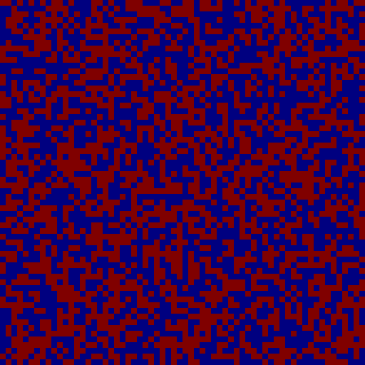
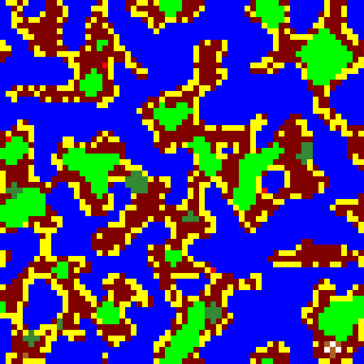
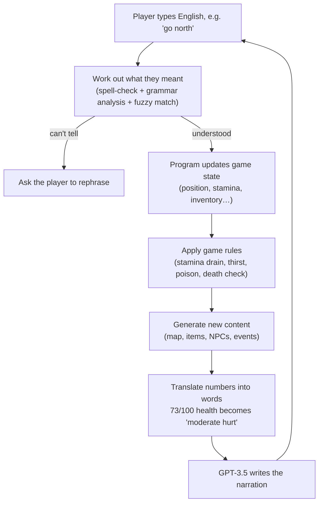

# A GPT-Narrated Interactive Fiction Engine

*[中文说明](README.md)*

A text adventure engine whose narrative content is generated at runtime rather than authored by hand.

The goal was to solve an engineering problem: language models invent things, so how do you make one behave
inside a game that has real rules and real state?

## At a glance

| | |
|---|---|
| **Type** | Undergraduate final-year project, BSc Artificial Intelligence, University of Manchester |
| **Dates** | September 2023 to April 2024 |
| **Team** | Two people. Architecture, state management, rule system, procedural content generation, GPT integration and the fine-tuning experiment by [@keepOrCounter](https://github.com/keepOrCounter); the natural-language input parser by [@WaiHL](https://github.com/WaiHL); design decisions discussed jointly |
| **Size** | ~3,800 lines of engine Python, ~870 lines of tests, ~6,650 lines in the repository |
| **Stack** | Python, OpenAI GPT-3.5 API, model fine-tuning, cellular automata, spaCy, NumPy, OpenCV |
| **Outcome** | A complete playable game, and a reusable engine underneath it |

---

## What it looks like

Internally the game holds nothing but structured data: where the player is, and what is around them.

```
Current location: beach
Front: river     Back: land     Right: beach     Left: land
Landscape features: [rocks]
Items: [palm leaf]
Food: [raw fish]
Movement difficulty: normal
```

The engine hands that to GPT-3.5, and the player sees this:

> You find yourself standing on a tranquil beach, with the gentle sound of waves lapping against the shore.
> The scenery is serene and picturesque, offering a sense of calm amidst the surrounding elements.
>
> Ahead of you, a river flows peacefully, adding a touch of movement to the otherwise tranquil scene.
> Behind you, the beach extends into the distance, inviting exploration.
>
> To your right, the beach continues, while to your left, the land stretches out, contrasting the soft sands
> with rugged terrain.
>
> Scattered across the landscape, you notice a few large rocks, adding a natural element to the scene.
> Nearby, a palm leaf lies on the ground, a testament to the tropical climate of the area.
>
> Additionally, you spot a raw fish, a potential source of sustenance, nestled among the rocks.
>
> This idyllic setting offers a peaceful respite amidst the challenges of survival.

*(Quoted in full from the project's run log, `modules/log.txt`. Real engine output, not a hand-written sample.
Every element of the prose traces back to a field in the data above.)*

**The map is generated the same way.** On the left is the random noise the program starts from; on the right is
that same data after the generation algorithm runs. Land has pulled together into islands, coastlines have
grown beaches, and forest, grassland, mountain and town have settled on top.

<p align="center">
  
  
</p>

---

## The problem

In a conventional text adventure the map, items and events are all written by hand, so the amount of content
is capped by how much the developers can write. Handing narration to a language model solves that, but
immediately creates a new problem: **the model hallucinates, and invents events that contradict the game
state established earlier.** The narration said there was no key in the player's bag, and then the model
writes that they "unlocked the door with the key".

What this project set out to test: can the problem be suppressed at the root through architecture, rather than
by piling on prompt instructions?

## The core design: the simulation is the single source of truth

- **An ordinary program containing no AI owns every fact about the world.** How much stamina the player has,
  how many loaves are in the bag, whether there is a wolf in this forest: all tracked and decided in code.
- **The model does exactly one job**: turn those settled facts into prose.

That choice downgrades hallucination from "could break the game logic" to "might write something a bit
dull".

An earlier prototype without an engine is kept in `testGame/testSampleNoEngine/`: its map and items are
hard-coded, and hallucination is fought by instructing the model in the prompt not to write anything outside
the supplied list. That approach has a low ceiling, and it is what motivated building the full engine.

### A full turn



---

## Three key design decisions

### 1. Give the model a simpler multiple choice, not free response

Resolving an event, say what happens after a snake bites you, is where things go wrong most easily. Left to
improvise, a model will award an effect the game has no concept of. So the engine lists every outcome this
event is allowed to have, and the model may only pick numbers from that list:

```
What the engine offers:
  Possible rewards:   ① raise max health  ② raise max stamina  ③ obtain venom
  Possible penalties: ① lose health       ② lose stamina       ③ become poisoned

What the model replies: penalty ③, plus a description:
  "You decide to suck the wound, hoping to extract the poison. Unfortunately, your efforts
   prove in vain. The venom takes hold, making the journey ahead more challenging."
```

The model has real authority over how the story turns, but cannot invent an effect the designer never
defined.

### 2. The model never sees a number

Before anything reaches the model, the engine translates every quantity into plain language:

| Real state inside the program | What the model is actually told |
|---|---|
| health 73 / 100 | moderately hurt |
| stamina 22 / 100 | exhausted |
| food freshness -5 | stale |
| movement difficulty 4 | extremely hard to travel through |
| NPC relationship -14 | hostile |

The model cannot do arithmetic badly on numbers it never received, and it cannot leak `HP: 73/100` into what
is supposed to be a novel. Rebalancing the game's numbers later also requires no change to the prompts.

### 3. The map is random, but walking back does not change it

The world is unbounded, so reaching the edge generates the next region on the spot, and the obvious hazard is
that retracing your steps shows you completely different land. The fix is to remember one random seed per
region: walk back, replay that seed, and the identical map comes out, so the world stays stable without ever
being saved to disk.

The terrain itself is produced by **cellular automata**, the algorithm that turned noise into islands in the
image above. Ten terrain types are layered in a fixed order, each with its own growth rule and restrictions,
so beaches only form on coastlines, snowfields only on mountains, and towns only on habitable ground, with
nothing placed by hand.

---

## What is in the game

- **Survival systems**: health, stamina, thirst, carry weight, and status effects such as thirst, poisoning
  and recovery
- **Ten terrain types**: sea, land, river, forest, beach, desert, mountain, highland snowfield, town,
  grassland, each with its own movement cost and spawns
- **Automatic item distribution**: every item carries a per-terrain likelihood, so aloe vera grows on the
  beach and fish appear in rivers, with no location-by-location authoring
- **Ten player actions**: go, rest, take, equip, unequip, check, eat, fill, talk, attack
- **Events**: survival crises (low stamina or health, eating something spoiled) and disasters (dust storms),
  each with trigger conditions and consequences
- **NPCs**: wolves attack the player, grow more likely to flee as they are wounded, and track how they feel
  about the player
- **Free-text input**: no command syntax to memorise; the player writes English

---

## Experiment results

To improve narrative consistency, two routes were tried:

1. **Context-aware prompt templates**: send only the state relevant to the current scene, after the
   number-to-words translation above. This is what shipped.
2. **Small-sample fine-tuning**: hand-written (game state -> ideal narration) examples trained through OpenAI's
   fine-tuning API. The set actually used was `data/output.jsonl`, **16 examples**.

**Neither route closed the gap left by GPT-3.5's own reasoning ability.** Prompt engineering reliably fixed
format and register, but not reasoning: whenever staying consistent required following a chain of cause and
effect across several pieces of state, GPT-3.5 still broke. On the fine-tuning side the bottleneck was
unambiguous: 16 examples is nowhere near enough data, and the model never learned a stable pattern.

This was not a fully successful experiment, but locating the problem precisely is worth more than dressing it
up as one. Redone today, the likely approach would be to collect more data, or move to a stronger model.

---

<br>

> Everything below is for developers. Non-technical readers can stop here.

---

## Running it

Requires **Python 3.9+** (developed on 3.11) and an OpenAI API key.

```bash
git clone https://github.com/keepOrCounter/Third_year_project_IFadGame.git
cd Third_year_project_IFadGame

python -m venv .venv && source .venv/bin/activate   # Windows: .venv\Scripts\activate
pip install -r requirements.txt
python -m spacy download en_core_web_sm             # required by the command parser

cd modules        # modules import each other flatly, so run from inside this directory
python main.py
```

The game asks for your API key on stdin at startup, then plays in the terminal:

```
To start the game, please provide an openai key>>>
What would you do?>>> go north
What would you do?>>> take berries
What would you do?>>> eat berries
```

Type `__exit` to quit. Every prompt and completion is appended to `modules/log.txt`.

> **Before your first run, change the model.** `interactionSys.Gpt3` pins a fine-tuned model that is private
> to the account that trained it, so any other key will get a 404. Change `self.model` to `"gpt-3.5-turbo"` or
> another available model. See [Known limitations](#known-limitations).

### Fine-tuning data pipeline

```bash
cd data
python transfer.py    # backup.json into output.jsonl (OpenAI fine-tuning format, 16 examples)
python check.py       # format validation and token cost estimate, per the OpenAI cookbook
```

`data/eventTune.jsonl` holds a separate 9 examples of event narration that did not go into the final
fine-tune.

### Tests

```bash
cd modules && python -m unittest testMain -v
```

Covers movement and its costs, inventory add/remove, consumption, pick-up, equipping, combat and the content
generators. **1 of the 7 cases passes today**; what fails is the test code, not the game logic, see
[Known limitations](#known-limitations).

## Repository layout

| Path | What it is |
|---|---|
| `modules/main.py` | Turn loop, survival rules, scoring, entry point |
| `modules/status_record.py` | Pure state model: items, NPCs, locations, player, world. No game logic, no GPT |
| `modules/Pre_definedContent.py` | Command implementations, map generation rules, status-effect engine, and all content definitions |
| `modules/PCGsys.py` | Map, object, NPC and event generators, and the per-turn controller |
| `modules/interactionSys.py` | GPT client, prompt construction and narration; natural-language input parsing |
| `modules/testMain.py` | Test suite for the rule and command layer |
| `data/` | Fine-tuning pipeline: `backup.json` → `transfer.py` → `output.jsonl` → `check.py` |
| `test/` | Standalone spikes for the NLP parsing and NPC work |
| `testGame/testSampleNoEngine/` | The early no-engine prototype and the Perlin-noise map experiment |

## Known limitations

This is the code as submitted in April 2024, and it has not been modernised since. Four known problems:

1. **The GPT integration is pinned to a configuration that no longer exists**: the hard-coded fine-tuned model
   is private to the account that trained it, the SDK is stuck below `openai<1.0`, and the base model is a
   legacy generation. The fix is to move the model, key and `base_url` into the environment.
2. **Response parsing is not hardened**: bare `except:`, unbound variables after exhausted retries,
   order-dependent key access, and unvalidated reward/penalty indices. The fix is JSON mode plus schema
   validation, degrading rather than crashing when retries run out.
3. **The test suite has drifted**: 1 of 7 cases passes, but what fails is the test code, not the game logic.
   The engine's interfaces changed late in the project and the tests were never updated: the action name
   became `"Go"` instead of `"Move"`, `npcGenerator` gained a parameter, and `pickUp` and `equip` now require
   a full action object where the tests still pass `None`. All renames and signature changes; the game runs
   fine.
4. **Smaller things**: disambiguation blocks on `input()`, no save/load, and the map visualiser needs a
   desktop.

## Credits

- **[@keepOrCounter](https://github.com/keepOrCounter)**: engine architecture; state model, rule system,
  command layer, procedural content generation, event system, GPT integration and prompt design, fine-tuning
  pipeline, test suite.
- **[@WaiHL](https://github.com/WaiHL)**: the natural-language input-parsing module in `interactionSys.py`
  (spelling correction and the spaCy grammar classifier) and the related spikes in `test/`.

Design decisions were discussed jointly.
