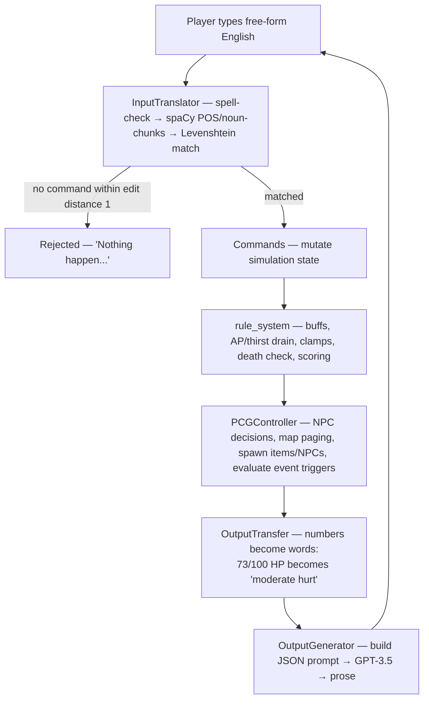

# IFadGame — A GPT-Narrated Interactive Fiction Engine

*[中文说明](README.zh-CN.md)*

A playable text-adventure engine where the **world, the items, the terrain and the events are generated at
runtime** instead of being authored by hand — and where GPT-3.5 is deliberately confined to the role of
*narrator* rather than being allowed to run the game.

> Undergraduate final-year project, BSc Artificial Intelligence, University of Manchester (Sep 2023 – Apr 2024).

<p align="center">
  
  
</p>
<p align="center">
  <em>Left: the seeded noise the map generator starts from. Right: the same seed after five cellular-automaton
  generations and terrain layering — landmasses ringed by beaches, with forest, grassland, mountain and town.
  Both images are produced by the engine in this repository.</em>
</p>

---

## The problem this project is about

The obvious way to build an "AI text adventure" is to hand the whole game to the language model: let it
describe the world, decide what happens, and track the consequences. That prototype is in this repository too
(`testGame/testSampleNoEngine/`), and it fails in the way you would expect. The model forgets that you already
drank the water, revives an enemy you killed two turns ago, and quietly invents a door that was never there.
The state of the world lives only in the transcript, so anything that falls out of the context window stops
being true.

**This engine inverts the relationship.** A conventional simulation — object-oriented state, a rule system, a
procedural content generator — owns every fact about the world. GPT-3.5 is called only to turn that state into
English prose. The model never decides what is true; it decides how what is true should *read*.

Everything below is a consequence of that one decision.

---

## How a turn works



The loop itself is in [`modules/main.py`](modules/main.py) and is deliberately small — every step above is a
call into a module that can be swapped or tested on its own.

---

## Three things in here worth reading the code for

### 1. GPT resolves events, but only by picking from a menu the engine wrote

Letting a language model decide the outcome of an event is where hallucination usually gets in. Here the model
is handed the event, the player's action, and two engine-supplied lists — `possible_reward` and
`possible_penalty` — and is required to answer with **indices into those lists**:

```jsonc
// what the engine sends
{
  "event_name": "Venomous Encounter",
  "player action": "suck the attacked part",
  "possible reward":  ["increase maximum hp", "increase maximum action point", "obtain a poison"],
  "possible penalty": ["decrease hp", "decrease action point", "add poisoning status"]
}

// what the model is allowed to answer
{ "successful": false, "fail": false, "reward": [], "penalty": [2],
  "development description": "You decide to suck the wound, hoping to extract the poison…" }
```

Those indices are then resolved through `eventCommandMap` → `commandTranslate` → real mutations on
`Player_status`. The model gets genuine narrative authority over *how the story turns*, and no ability
whatsoever to invent an effect the designer did not define. See
[`PCGsys.eventGenerator.event_handler`](modules/PCGsys.py) and `DefininedSys.get_eventCommandMap`.

### 2. No number ever reaches the prompt

`OutputTransfer.outputWordMap` ([`modules/Pre_definedContent.py`](modules/Pre_definedContent.py)) is a
declarative table that converts every engine quantity into the vocabulary a narrator would actually use,
*before* the prompt is built:

| Engine state | What GPT is told |
|---|---|
| `hp = 73 / 100` | `"moderate hurt"` |
| `action_point = 22 / 100` | `"exhausted"` |
| `freshness = -5` | `"stale"` |
| `move_dLevel = 4` | `"extremely hard to travel through"` |
| `relationship = -14` | `"hostile"` |

This kills a whole class of failure at the source. The model cannot do arithmetic badly on numbers it never
receives, and it cannot leak `HP: 73/100` into what is supposed to be prose. It also means the same prompt
template keeps working when the designer rebalances the numbers.

### 3. Procedural generation that is random but not forgetful

Terrain is produced by 2D cellular automata (`cellpylib`) rather than Perlin noise — an experiment comparing
the two is preserved in `testGame/testSampleNoEngine/`. Ten terrain types are layered in a fixed order, each
with its own CA rule and an `allowedAppearUpon` constraint, so beaches form on the coast, snowfields only on
mountains, and towns only on habitable ground.

The world is unbounded: it is paged into areas, and crossing a boundary generates the next one. The catch with
generating on demand is that a naive implementation gives you a *different* world every time you walk back.
`MapGenerator.map_Seed()` assigns a seed per area coordinate and caches it, so a revisited area is regenerated
bit-for-bit identically while never being stored.

---

## What is in the box

- **Survival simulation** — HP, action points, thirst, carry weight, and a buff system (`thirsty`,
  `poisoning`, `recovery`) with trigger and expiry conditions expressed as lambdas.
- **Ten terrain types** — sea, land, river, forest, beach, desert, mountain, highland snowfield, town,
  grassland; each with its own movement cost and its own item/NPC spawn table.
- **Weighted content spawning** — every item carries a per-terrain probability (0–20; ≥20 means guaranteed),
  so `aloe vera` shows up in the desert and `fish` in the river without any per-location authoring.
- **Ten player verbs** — `Go`, `Rest`, `Take`, `Equip`, `Unequip`, `Check`, `Eat`, `Fill`, `Talk`, `Attack`,
  each defined as data (`Actions`) rather than as a branch in a parser.
- **An event system** — survival crises (low AP/HP/thirst, eating something inedible) and disasters (dust
  storms, biased by terrain), each with trigger conditions, time limits and reward/penalty menus.
- **NPCs** — wolves with HP, attack, escape probability that rises as they are wounded, and a relationship
  scale toward the player.
- **Free-text input** — no `VERB NOUN` grammar; the player types English and a spell-check → spaCy →
  Levenshtein pipeline maps it onto the command vocabulary.

## Repository layout

| Path | What it is |
|---|---|
| `modules/main.py` | Turn loop, survival rules, scoring, entry point |
| `modules/status_record.py` | Pure state model — items, NPCs, locations, player, world. No game logic, no GPT |
| `modules/Pre_definedContent.py` | Command implementations, CA map rules, buff engine, and the content registry (`DefininedSys`) |
| `modules/PCGsys.py` | Map / object / NPC / event generators and the per-turn `PCGController` |
| `modules/interactionSys.py` | GPT client, prompt construction and narration; natural-language input parsing |
| `modules/testMain.py` | `unittest` suite for the rule and command layer |
| `data/` | Fine-tuning pipeline: `backup.json` → `transfer.py` → `output.jsonl` → `check.py` |
| `test/` | Standalone spikes for the NLP parsing and NPC work |
| `testGame/testSampleNoEngine/` | The no-engine baseline prototype and the Perlin-noise map experiment |
| `docs/ARCHITECTURE.md` | Module-by-module design notes and an extension guide |

---

## Running it

Requires **Python 3.9+** (developed on 3.11) and an OpenAI API key.

```bash
git clone https://github.com/keepOrCounter/Third_year_project_IFadGame.git
cd Third_year_project_IFadGame

python -m venv .venv && source .venv/bin/activate   # Windows: .venv\Scripts\activate
pip install -r requirements.txt
python -m spacy download en_core_web_sm             # required by the command parser

cd modules        # modules import each other flatly, so run from inside this directory
python main.py
```

The game asks for your API key on stdin at startup, then plays in the terminal:

```
To start the game, please provide an openai key>>>
What would you do?>>> go north
What would you do?>>> take berries
What would you do?>>> eat berries
```

Type `__exit` to quit. Every prompt and completion is appended to `modules/log.txt` for inspection.

> **Before your first run — change the model.** `interactionSys.Gpt3.__init__` pins a fine-tuned model
> (`ft:gpt-3.5-turbo-0125:3rdprojectgroup:…`) that is private to the account that trained it, so any other key
> will get a 404. Change `self.model` to `"gpt-3.5-turbo"` — or to whatever you want to narrate with — before
> playing. See [Known limitations](#known-limitations).

### Tests

```bash
cd modules && python -m unittest testMain -v
```

Covers movement and AP/thirst costs, inventory add/remove, consumption, pick-up, equipping, combat and the
content generators. Part of the suite still targets an earlier revision of the command API — see
[Known limitations](#known-limitations).

---

## The fine-tuning experiment

Two routes were tried to get GPT-3.5 to narrate *consistently* — to keep a stale piece of bread stale, and to
stop the prose contradicting the simulation.

**Route 1 — context-aware prompt templates.** Structured JSON prompts carrying only the state relevant to what
is being described, with the numeric→linguistic abstraction above applied first. This is what ships.

**Route 2 — supervised fine-tuning.** A small hand-written corpus of (game state → ideal narration) pairs,
converted to OpenAI chat JSONL and validated for format and token cost:

```bash
cd data
python transfer.py    # backup.json  →  output.jsonl  (system/user/assistant triples)
python check.py       # format validation + tiktoken cost estimate, per the OpenAI cookbook
```

**What actually happened.** Neither route closed the gap. Prompt engineering reliably fixed *format* and
*register* but not *reasoning*: when consistency required the narrator to follow a chain of implications
across several state fields, GPT-3.5 still broke. Fine-tuning moved style strongly and consistency barely —
and with 25 training examples in total, the honest conclusion is that the corpus was far too small to
attribute that to the method rather than to the data. The limit being hit was the base model's reasoning
ability, not the prompt format.

That negative result is the most useful thing the project produced, and it is the reason the architecture
above matters: given a model that *will* be inconsistent, the engineering answer is to shrink the surface it
can be inconsistent on.

---

## Known limitations

This is the code as submitted in April 2024, and it has not been modernised since. The list below is what I
would fix and how — kept in the README rather than in a private TODO, because a reader deserves to know what
they are cloning.

### The GPT integration is pinned to a configuration that no longer exists

Three separate problems, all in `interactionSys.Gpt3`:

1. `self.model` is a fine-tuned checkpoint (`ft:gpt-3.5-turbo-0125:3rdprojectgroup:…`) private to the account
   that trained it — any other key gets a 404.
2. The call is `openai.ChatCompletion.create`, removed in `openai>=1.0`, hence the `openai<1.0` pin.
3. `gpt-3.5-turbo` is a legacy generation being wound down regardless.

**The fix** is to stop hard-coding a model at all: have `Gpt3` read `api_key`, `model` and `base_url` from the
environment, and port `inquiry` to the 1.x client. A configurable `base_url` additionally lets the narrator be
any OpenAI-compatible endpoint, local models via Ollama or vLLM included.

Worth noting what that change would *not* touch: `status_record.py`, `Pre_definedContent.py` and `main.py` —
the state model, content registry, command layer and turn loop — stay byte-identical. The entire LLM
integration can be replaced without the simulation noticing, which is precisely the property the architecture
was built for.

### Response parsing is not hardened

The narration layer trusts the model more than it should:

| Where | Problem |
|---|---|
| `interactionSys.py:260, 303, 338, 390` | Bare `except:` swallows everything, including `KeyboardInterrupt`, and hides the real cause |
| `interactionSys.py:266, 308, 316, 345, 414` | After three failed retries `gpt_response` / `result` were never bound → `NameError` |
| `interactionSys.py:258, 388` | `parsed_output[keyList[1]]` reads the description by **key order**; a different key order returns the wrong field |
| `interactionSys.py:252-254` | A newline round-trip hack, needed only to make `ast.literal_eval` accept the reply |
| throughout | `ast.literal_eval` and `json.loads` are used at different call sites; the former rejects JSON `true`/`false`/`null` |
| `PCGsys.py:550, 560` | Reward/penalty indices from the model are not validated — out of range raises `IndexError`, non-numeric raises `ValueError`, and the `eventCommandMap` lookup has no `KeyError` guard |

**The fix**: request JSON mode / structured outputs so most parse failures stop happening at all; validate the
reply against the expected schema and clamp indices to the menu the engine supplied; and, when retries are
exhausted, fall back to an engine-generated template description instead of failing. That last one follows
directly from the project's own premise — narration is decorative, the facts live in the simulation, so a dead
narrator should degrade the prose, not stop the game. Today it stops the game.

### The test suite has drifted

`modules/testMain.py` was written against a mid-project revision of the command API; 1 of its 7 cases passes
today. The causes are mechanical rather than deep: the action registry key is now `"Go"` rather than `"Move"`;
`pickUp` / `equip` now write to `action.nameForDescription` and so require a real `Actions` object where the
tests pass `None`; `npcGenerator` gained a `worldStatus` parameter; and `test_attack` blocks on the
interactive disambiguation prompt described below.

### Smaller things

- **Disambiguation blocks on `input()`.** When several matching items are in reach, `consume` and `pickUp`
  prompt on stdin from inside the command layer, which couples game logic to the terminal and is what makes
  those paths awkward to test.
- **No save/load.** The world is reproducible from its seeds, but player and inventory state is not persisted.
- **The map visualiser needs a desktop.** `MapGenerator.visualized` uses `cv2.imshow`; on a headless machine
  use `cv2.imwrite` instead (that is how the images at the top of this page were produced).

## Credits

- **[@keepOrCounter](https://github.com/keepOrCounter)** — engine architecture; state model, rule system,
  command layer, procedural content generation, event system, GPT integration and prompt design, fine-tuning
  pipeline, test suite.
- **[@WaiHL](https://github.com/WaiHL)** — the natural-language input-parsing module in `interactionSys.py`
  (spelling correction and the spaCy grammar classifier) and the related spikes in `test/`.

## License

No license has been chosen yet — all rights reserved by default. If you want this code to be reusable, add a
`LICENSE` file (MIT is the usual choice for a portfolio project); check your institution's policy on
final-year project IP first.
