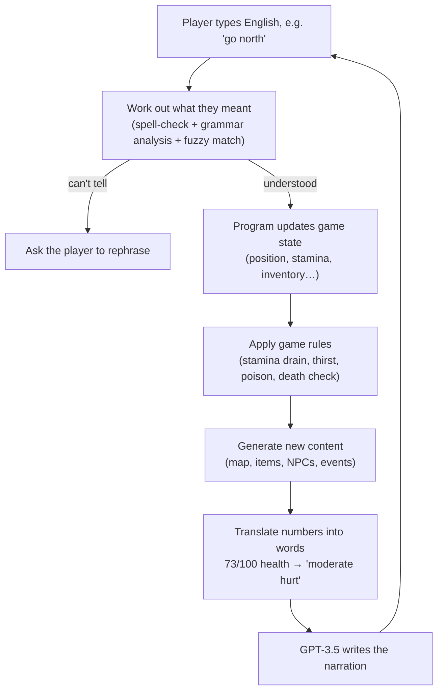

# A GPT-Narrated Interactive Fiction Engine

*[中文说明](README.zh-CN.md)*

A text adventure you can actually play. The player types freely in English, and the game answers in prose.

What makes it unusual: the map, the items and the events are all **generated by the program while you play** —
none of the world is written by hand in advance — and the language model (GPT-3.5) that turns all of it into
story is deliberately restricted to *describing* what happened, never to *deciding* it.

## At a glance

| | |
|---|---|
| **Type** | Undergraduate final-year project, BSc Artificial Intelligence, University of Manchester |
| **Dates** | September 2023 – April 2024 |
| **My role** | Sole author of the architecture and the engine (the natural-language input parser was written by a classmate — see Credits) |
| **Size** | ~3,800 lines of engine Python, ~870 lines of tests, ~6,650 lines in the repository |
| **Stack** | Python, OpenAI GPT-3.5 API, model fine-tuning, cellular automata, spaCy, NumPy, OpenCV |
| **Outcome** | A complete playable game, and a reusable engine underneath it |

---

## What it looks like

Internally the game holds nothing but **structured data** — where the player is, and what is around them:

```
Current location: beach
Front: river     Back: land     Right: beach     Left: land
Landscape features: [rocks]
Items: [palm leaf]
Food: [raw fish]
Movement difficulty: normal
```

The engine hands that to GPT-3.5, and the player sees this:

> You find yourself standing on a tranquil beach, with the gentle sound of waves lapping against the shore.
> The scenery is serene and picturesque, offering a sense of calm amidst the surrounding elements.
>
> Ahead of you, a river flows peacefully, adding a touch of movement to the otherwise tranquil scene.
> Behind you, the beach extends into the distance, inviting exploration.
>
> To your right, the beach continues, while to your left, the land stretches out, contrasting the soft sands
> with rugged terrain.
>
> Scattered across the landscape, you notice a few large rocks, adding a natural element to the scene.
> Nearby, a palm leaf lies on the ground, a testament to the tropical climate of the area.
>
> Additionally, you spot a raw fish, a potential source of sustenance, nestled among the rocks.
>
> This idyllic setting offers a peaceful respite amidst the challenges of survival.

*(Quoted in full from the project's run log, `modules/log.txt` — real engine output, not a hand-written
sample. Every element of the prose traces back to a field in the data above.)*

**The map is generated the same way.** On the left is the random noise the program starts from; on the right is
that same data after the generation algorithm runs — land has pulled together into islands, coastlines have
grown beaches, and forest, grassland, mountain and town have settled on top:

<p align="center">
  
  
</p>

---

## The problem this project is about

The obvious way to build an "AI text adventure" is to hand the whole game to the language model: let it
describe the world, decide what happens, and remember the consequences.

**That approach fails**, in a very recognisable way. The model forgets that you already drank the water,
revives an enemy you killed two turns ago, and quietly invents a door that was never there. The reason is not
mysterious: the state of the world exists only in the conversation history, so once that history grows past
what the model can hold, those facts simply stop being true. The industry name for this is **hallucination**.

I built that version too — it is in `testGame/testSampleNoEngine/`, kept as the baseline it failed to beat.

## The approach: the model is only a narrator

This engine inverts the relationship:

- **An ordinary program**, containing no AI at all, owns every fact about the world — how much stamina you
  have, how many loaves are in your bag, whether there is a wolf in this forest. All of it tracked and
  computed exactly, with no involvement from the model.
- **The model does exactly one job**: turn those facts into good prose.

In one sentence: **the model never decides what is true; it decides how what is true should read.**

However florid it gets, it cannot change a single fact in the game — hallucination is held outside the game
logic by the architecture itself. Everything below follows from that one decision.

### A full turn



---

## Three key design decisions

### 1. The model gets multiple choice, not free response

Resolving an event — say, what happens after a snake bites you — is where things go wrong most easily. Left to
improvise, a model will happily award the player an effect the game has no concept of.

So the engine writes out **every outcome this event is allowed to have** and lets the model only **pick from
the list**:

```
What the engine offers:
  Possible rewards:   ① raise max health  ② raise max stamina  ③ obtain venom
  Possible penalties: ① lose health       ② lose stamina       ③ become poisoned

What the model replies: penalty ③, plus a description —
  "You decide to suck the wound, hoping to extract the poison. Unfortunately, your efforts
   prove in vain. The venom takes hold, making the journey ahead more challenging."
```

The model has real authority over how the story turns, and **no ability to invent an effect the designer never
defined** — because every option it can pick maps to a piece of logic already written in the program.

### 2. The model never sees a number

Before anything reaches the model, the engine translates every quantity into plain language:

| Real state inside the program | What the model is actually told |
|---|---|
| health 73 / 100 | moderately hurt |
| stamina 22 / 100 | exhausted |
| food freshness −5 | stale |
| movement difficulty 4 | extremely hard to travel through |
| NPC relationship −14 | hostile |

This removes a whole class of failure: the model cannot do arithmetic badly on numbers it never received, and
it cannot leak `HP: 73/100` into what is supposed to be a novel. It also means rebalancing the game's numbers
later requires no change to the prompts at all.

### 3. The map is random, but walking back doesn't change it

The world is unbounded — reach the edge and the next region is generated on the spot. The obvious hazard is
that when the player retraces their steps they find **completely different** land.

The fix is to remember one random seed per region. Walk back, replay that seed, and the identical map comes
out — so the world stays stable and trustworthy without ever being saved to disk.

The terrain itself is produced by **cellular automata** (the algorithm that turned noise into islands in the
image above). Ten terrain types are layered in a fixed order, each with its own growth rule and its own
restrictions, so beaches only form on coastlines, snowfields only on mountains, and towns only on habitable
ground — the geography comes out plausible without anything being placed by hand.

---

## What's in the game

- **Survival systems** — health, stamina, thirst, carry weight, and status effects such as thirst, poisoning
  and recovery
- **Ten terrain types** — sea, land, river, forest, beach, desert, mountain, highland snowfield, town,
  grassland, each with its own movement cost and its own spawns
- **Automatic item distribution** — every item carries a per-terrain likelihood, so aloe vera grows in the
  desert and fish appear in rivers with no location-by-location authoring
- **Ten player actions** — go, rest, take, equip, unequip, check, eat, fill, talk, attack
- **Events** — survival crises (low stamina or health, eating something spoiled) and disasters (dust storms),
  each with trigger conditions and consequences
- **NPCs** — wolves attack the player and grow more likely to flee as they are wounded; NPCs track how they
  feel about the player
- **Free-text input** — no command syntax to memorise; the player writes English and the engine works it out

---

## The fine-tuning experiment

To get the model to narrate **consistently** — so that a stale loaf stays stale a paragraph later — I tried two
routes:

1. **Prompt engineering** — send only the state relevant to the current scene, after the number-to-words
   translation above. This is what shipped.
2. **Fine-tuning** — hand-write (game state → ideal narration) examples and train a dedicated model through
   OpenAI's fine-tuning API.

**Neither route solved it**, and that negative result is the most valuable thing the project produced.

Prompt engineering reliably fixed *format* and *register*, but not *reasoning*: whenever staying consistent
required following a chain of cause and effect across several pieces of state, GPT-3.5 still broke.
Fine-tuning moved the writing style noticeably and consistency barely — but with only 25 training examples,
the honest conclusion is that **the corpus was far too small to tell whether the method or the data was at
fault**.

What the project actually ran into was the reasoning ceiling of the base model, not a badly written prompt.

Which is exactly the point of the architecture above: **given a model that will be inconsistent, the
engineering answer is to shrink the surface it can be inconsistent on** — keep the facts in the program, and
the model's mistakes can never reach the game logic.

---

<br>

> Everything below is for developers. Non-technical readers can stop here.

---

## Running it

Requires **Python 3.9+** (developed on 3.11) and an OpenAI API key.

```bash
git clone https://github.com/keepOrCounter/Third_year_project_IFadGame.git
cd Third_year_project_IFadGame

python -m venv .venv && source .venv/bin/activate   # Windows: .venv\Scripts\activate
pip install -r requirements.txt
python -m spacy download en_core_web_sm             # required by the command parser

cd modules        # modules import each other flatly, so run from inside this directory
python main.py
```

The game asks for your API key on stdin at startup, then plays in the terminal:

```
To start the game, please provide an openai key>>>
What would you do?>>> go north
What would you do?>>> take berries
What would you do?>>> eat berries
```

Type `__exit` to quit. Every prompt and completion is appended to `modules/log.txt`.

> **Before your first run — change the model.** `interactionSys.Gpt3` pins a fine-tuned model that is private
> to the account that trained it, so any other key will get a 404. Change `self.model` to `"gpt-3.5-turbo"` or
> another available model. See [Known limitations](#known-limitations).

### Fine-tuning data pipeline

```bash
cd data
python transfer.py    # backup.json  →  output.jsonl (OpenAI fine-tuning format)
python check.py       # format validation + token cost estimate, per the OpenAI cookbook
```

### Tests

```bash
cd modules && python -m unittest testMain -v
```

Covers movement and its costs, inventory add/remove, consumption, pick-up, equipping, combat and the content
generators. **1 of the 7 cases passes today** — see [Known limitations](#known-limitations).

## Repository layout

| Path | What it is |
|---|---|
| `modules/main.py` | Turn loop, survival rules, scoring, entry point |
| `modules/status_record.py` | Pure state model — items, NPCs, locations, player, world. No game logic, no GPT |
| `modules/Pre_definedContent.py` | Command implementations, map generation rules, status-effect engine, and all content definitions |
| `modules/PCGsys.py` | Map / object / NPC / event generators and the per-turn controller |
| `modules/interactionSys.py` | GPT client, prompt construction and narration; natural-language input parsing |
| `modules/testMain.py` | Test suite for the rule and command layer |
| `data/` | Fine-tuning pipeline: `backup.json` → `transfer.py` → `output.jsonl` → `check.py` |
| `test/` | Standalone spikes for the NLP parsing and NPC work |
| `testGame/testSampleNoEngine/` | The no-engine baseline prototype and the Perlin-noise map experiment |
| `docs/ARCHITECTURE.md` | Module-by-module design notes and an extension guide |

## Known limitations

This is the code as submitted in April 2024, and it has not been modernised since. The list below is what I
would fix and how — kept in the README rather than in a private TODO, because a reader deserves to know what
they are cloning.

### The GPT integration is pinned to a configuration that no longer exists

Three separate problems, all in `interactionSys.Gpt3`:

1. `self.model` is a fine-tuned checkpoint (`ft:gpt-3.5-turbo-0125:3rdprojectgroup:…`) private to the account
   that trained it — any other key gets a 404.
2. The call is `openai.ChatCompletion.create`, removed in `openai>=1.0`, hence the `openai<1.0` pin.
3. `gpt-3.5-turbo` is a legacy generation being wound down regardless.

**The fix** is to stop hard-coding a model at all: have `Gpt3` read `api_key`, `model` and `base_url` from the
environment, and port `inquiry` to the 1.x client. A configurable `base_url` additionally lets the narrator be
any OpenAI-compatible endpoint, local models via Ollama or vLLM included.

Worth noting what that change would *not* touch: `status_record.py`, `Pre_definedContent.py` and `main.py` —
the state model, content definitions, command layer and turn loop — stay byte-identical. The entire LLM
integration can be replaced without the simulation noticing, which is precisely the property the architecture
was built for.

### Response parsing is not hardened

The narration layer trusts the model more than it should:

| Where | Problem |
|---|---|
| `interactionSys.py:260, 303, 338, 390` | Bare `except:` swallows everything, including `KeyboardInterrupt`, and hides the real cause |
| `interactionSys.py:266, 308, 316, 345, 414` | After three failed retries `gpt_response` / `result` were never bound → `NameError` |
| `interactionSys.py:258, 388` | `parsed_output[keyList[1]]` reads the description by **key order**; a different key order returns the wrong field |
| `interactionSys.py:252-254` | A newline round-trip hack, needed only to make `ast.literal_eval` accept the reply |
| throughout | `ast.literal_eval` and `json.loads` are used at different call sites; the former rejects JSON `true`/`false`/`null` |
| `PCGsys.py:550, 560` | Reward/penalty indices from the model are not validated — out of range raises `IndexError`, non-numeric raises `ValueError`, and the `eventCommandMap` lookup has no `KeyError` guard |

**The fix**: request JSON mode / structured outputs so most parse failures stop happening at all; validate the
reply against the expected schema and clamp indices to the menu the engine supplied; and, when retries are
exhausted, fall back to an engine-generated template description instead of failing. That last one follows
directly from the project's own premise — narration is decorative, the facts live in the simulation, so a dead
narrator should degrade the prose, not stop the game. Today it stops the game.

### The test suite has drifted

`modules/testMain.py` was written against a mid-project revision of the command API; 1 of its 7 cases passes
today. The causes are mechanical rather than deep: the action registry key is now `"Go"` rather than `"Move"`;
`pickUp` / `equip` now write to `action.nameForDescription` and so require a real `Actions` object where the
tests pass `None`; `npcGenerator` gained a `worldStatus` parameter; and `test_attack` blocks on the
interactive disambiguation prompt described below.

### Smaller things

- **Disambiguation blocks on `input()`.** When several matching items are in reach, `consume` and `pickUp`
  prompt on stdin from inside the command layer, which couples game logic to the terminal and is what makes
  those paths awkward to test.
- **No save/load.** The world is reproducible from its seeds, but player and inventory state is not persisted.
- **The map visualiser needs a desktop.** `MapGenerator.visualized` uses `cv2.imshow`; on a headless machine
  use `cv2.imwrite` instead (that is how the images at the top of this page were produced).

## Credits

- **[@keepOrCounter](https://github.com/keepOrCounter)** — engine architecture; state model, rule system,
  command layer, procedural content generation, event system, GPT integration and prompt design, fine-tuning
  pipeline, test suite.
- **[@WaiHL](https://github.com/WaiHL)** — the natural-language input-parsing module in `interactionSys.py`
  (spelling correction and the spaCy grammar classifier) and the related spikes in `test/`.

## License

No license has been chosen yet — all rights reserved by default. If you want this code to be reusable, add a
`LICENSE` file (MIT is the usual choice for a portfolio project); check your institution's policy on
final-year project IP first.
