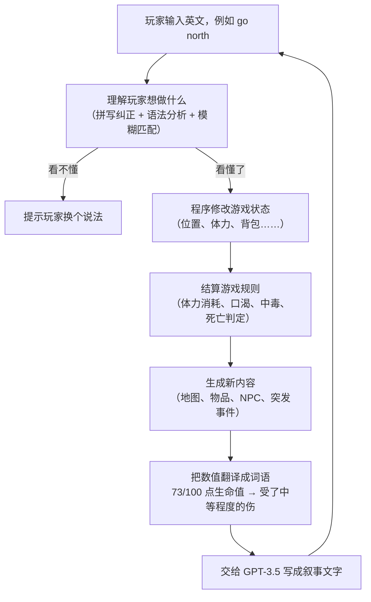

# 基于 GPT 的互动小说游戏引擎

*[English](README.md)*

一个叙事内容在运行时动态生成、而非人工预先编写的文字冒险游戏引擎。

核心目标不是「接一个 GPT API 生成文字」，而是解决一个工程问题：大模型天生会编造，怎么让它在一个有规则、有状态的游戏系统里老实干活。

## 项目速览

| | |
|---|---|
| **项目性质** | 本科毕业设计，曼彻斯特大学 人工智能理学学士 |
| **时间** | 2023 年 9 月 至 2024 年 4 月 |
| **分工** | 两人项目。架构设计、状态管理、规则系统、程序化内容生成、GPT 集成与微调实验由 [@keepOrCounter](https://github.com/keepOrCounter) 完成；自然语言输入解析模块由 [@WaiHL](https://github.com/WaiHL) 完成；设计思路由两人共同讨论 |
| **代码规模** | 引擎核心约 3,800 行 Python，测试约 870 行，全仓库约 6,650 行 |
| **技术栈** | Python、OpenAI GPT-3.5 API、模型微调、元胞自动机、spaCy、NumPy、OpenCV |
| **成果** | 可运行的完整游戏，以及底层一套可复用的引擎 |

---

## 效果演示

游戏内部只有一份结构化数据，记录玩家此刻在哪、周围有什么：

```
当前位置：海滩
前方：河流    后方：陆地    右侧：海滩    左侧：陆地
地形特征：[岩石]
物品：[棕榈叶]
食物：[生鱼]
移动难度：正常
```

引擎把这份数据交给 GPT-3.5，得到玩家在屏幕上真正看到的文字：

> You find yourself standing on a tranquil beach, with the gentle sound of waves lapping against the shore.
> The scenery is serene and picturesque, offering a sense of calm amidst the surrounding elements.
>
> Ahead of you, a river flows peacefully, adding a touch of movement to the otherwise tranquil scene.
> Behind you, the beach extends into the distance, inviting exploration.
>
> To your right, the beach continues, while to your left, the land stretches out, contrasting the soft sands
> with rugged terrain.
>
> Scattered across the landscape, you notice a few large rocks, adding a natural element to the scene.
> Nearby, a palm leaf lies on the ground, a testament to the tropical climate of the area.
>
> Additionally, you spot a raw fish, a potential source of sustenance, nestled among the rocks.
>
> This idyllic setting offers a peaceful respite amidst the challenges of survival.

*（以上完整摘自项目运行日志 `modules/log.txt`，是引擎实时生成的真实输出，不是人工撰写的样例。
文中每一处景物，都能对应回上面那份数据里的一个字段。）*

**地图同样是自动生成的。** 左图是程序最初产生的随机噪点，右图是同一份数据经算法演化后的结果：陆地聚合成成片的岛屿，
海岸线自动生长出沙滩，其上分布着森林、草原、山地与城镇。

<p align="center">
  
  
</p>

---

## 要解决的问题

传统文字冒险游戏的地图、物品、事件都由人工预先写死，内容量受限于开发者能写多少。把叙事交给大模型能解决内容量问题，
但立刻引入新问题：**大模型会产生幻觉，编出与游戏实际状态矛盾的情节**，比如玩家背包里没有钥匙，
模型却写玩家「用钥匙打开了门」。根本原因是，如果世界状态只存在于对话历史里，一旦历史超出模型能记住的范围，
这些事实就不再为真。

项目要验证的是：能不能靠架构设计，而不是靠堆提示词，把这个问题从根上控制住。

## 核心设计：模拟系统是唯一事实来源

- **一套不含任何 AI 的常规程序独占世界的全部事实**：玩家有多少体力、背包里有几块面包、这片森林里有没有狼，
  全部由代码精确记录和判定。
- **大模型只做一件事**：把这些既定事实写成文字。

一句话概括：模型不决定「什么是真的」，只决定「真的东西该怎么读起来」。
这个选择把幻觉的影响范围，从「可能搞坏游戏逻辑」降级成了「最多写得不够生动」。

项目早期做过一个没有引擎的原型（`testGame/testSampleNoEngine/`）：地图和物品全部手写死，
靠在提示词里反复叮嘱模型「不要写清单以外的东西」来压制幻觉。这条路上限很低，也是后来做完整引擎的直接动因。

### 一个回合的流程



---

## 三个关键设计

### 一、让模型做选择题，而不是问答题

事件结算（比如「被蛇咬了之后会怎样」）最容易出问题：让模型自由发挥，它可能凭空加一个游戏里不存在的效果。
所以引擎先把这次事件允许出现的所有后果列成清单，模型只能从清单里挑编号：

```
引擎给出的清单：
  可能的奖励：① 提升生命上限  ② 提升体力上限  ③ 获得一份毒液
  可能的惩罚：① 扣生命值      ② 扣体力值      ③ 进入中毒状态

模型的回答：惩罚选 ③，并附上一段描述：
  "你试图把毒液吸出来，却徒劳无功。恶心与虚弱攫住了你，接下来的路更难走了。"
```

模型对「故事怎么转折」有真实的发挥空间，但造不出设计者没定义过的效果。

### 二、不让模型看见任何数字

在把信息交给模型之前，引擎先把所有数值换成人话：

| 程序内部的真实状态 | 实际告诉模型的内容 |
|---|---|
| 生命值 73 / 100 | 受了中等程度的伤 |
| 体力 22 / 100 | 精疲力尽 |
| 食物新鲜度 -5 | 已经变质了 |
| 移动难度系数 4 | 极其难以通行 |
| 与 NPC 好感度 -14 | 充满敌意 |

模型不可能在它从未收到的数字上算错，也不可能把 `HP: 73/100` 泄漏进本该是小说的文字里。
后续调整数值平衡时，提示词也完全不用改。

### 三、地图随机生成，但走回头路时不会变样

世界是无限大的，走到边界就现场生成下一块区域，最容易出的问题是玩家原路返回时看到一片完全不同的土地。
解决办法是给每块区域记住一个随机数种子，走回去时用同一个种子重算，就能得到一模一样的地图，既不用存地图，世界又是稳定的。

地形本身用**元胞自动机**生成，也就是上面演示图里从噪点变成岛屿的那个算法。十种地形按固定顺序逐层叠加，
每层有自己的生长规则和限制条件，于是沙滩只长在海岸线上、雪原只出现在山地之上、城镇只落在适合居住的地面，
不需要任何人工摆放。

---

## 游戏包含哪些内容

- **生存系统**：生命值、体力、口渴度、负重上限，以及口渴、中毒、恢复等状态效果
- **十种地形**：海洋、陆地、河流、森林、海滩、沙漠、山地、高原雪原、城镇、草原，各有移动消耗和产出
- **物品自动分布**：每件物品带有各地形下的出现概率，芦荟长在沙漠、鱼出现在河里，无需逐个地点手工编排
- **十种玩家动作**：移动、休息、拾取、装备、卸下、查看、进食、装水、交谈、攻击
- **突发事件**：生存危机（体力或生命过低、误食变质食物）与自然灾害（沙尘暴），各有触发条件和奖惩
- **NPC**：狼会攻击玩家，受伤后逃跑概率上升，并对玩家保有好感度
- **自由文本输入**：不需要背固定指令格式，玩家直接用英文表达

---

## 一个诚实的实验结论：为什么没有走微调这条路

为了提升叙事的上下文一致性，项目尝试了两条路径：

1. **上下文感知的提示词模板**：每次只把与当前场景相关的信息交给模型，并先做上面第二点的数值转人话处理。这是最终采用的方案。
2. **小样本微调**：人工编写「游戏状态 → 理想叙事」样本，用 OpenAI 微调接口训练专用模型。实际用于微调的是
   `data/output.jsonl`，共 **16 条**。

**结果是两条路都没能弥合 GPT-3.5 自身推理能力的差距。** 提示词工程能稳定修好格式和语气，但修不好推理：
当保持一致需要模型跨好几项状态推演一条因果链时，GPT-3.5 依然会出错。微调这一侧的瓶颈很明确，
16 条样本数据量远远不够，模型没能学到稳定的模式。

这不是一个「成功了」的故事，但把问题定位清楚比强行包装成功更有价值。如果重做，下一步是先把数据量做起来，
而不是继续在提示词上打转。这也正是前面那套架构的意义：既然模型必然会不一致，工程上的答案就是压缩它能够不一致的那个面。

---

<br>

> 以下内容面向开发者。非技术读者读到这里即可。

---

## 运行方式

需要 **Python 3.9+**（开发环境为 3.11）与一个 OpenAI API key。

```bash
git clone https://github.com/keepOrCounter/Third_year_project_IFadGame.git
cd Third_year_project_IFadGame

python -m venv .venv && source .venv/bin/activate   # Windows: .venv\Scripts\activate
pip install -r requirements.txt
python -m spacy download en_core_web_sm             # 指令解析器需要

cd modules        # 模块之间是扁平导入，必须在该目录下运行
python main.py
```

启动后会在命令行询问 API key，随后即可游玩：

```
To start the game, please provide an openai key>>>
What would you do?>>> go north
What would you do?>>> take berries
What would you do?>>> eat berries
```

输入 `__exit` 退出。所有提示词与模型返回都会追加写入 `modules/log.txt`。

> **首次运行前请先改模型。** `interactionSys.Gpt3` 里写死了一个微调模型，它仅对训练它的账号可见，
> 用其他 key 会得到 404。请把 `self.model` 改成 `"gpt-3.5-turbo"` 或其他可用模型，详见[已知限制](#已知限制)。

### 微调数据管线

```bash
cd data
python transfer.py    # backup.json 转成 output.jsonl（OpenAI 微调所需格式，16 条）
python check.py       # 格式校验与 token 成本估算，参照 OpenAI cookbook
```

`data/eventTune.jsonl` 是另外准备的 9 条事件叙事样本，未进入最终微调。

### 测试

```bash
cd modules && python -m unittest testMain -v
```

覆盖移动与消耗、背包增删、进食、拾取、装备、战斗以及内容生成器。**目前 7 个用例中只有 1 个能通过**，
原因见[已知限制](#已知限制)。

## 项目结构

| 路径 | 内容 |
|---|---|
| `modules/main.py` | 回合主循环、生存规则、计分、程序入口 |
| `modules/status_record.py` | 纯状态模型：物品、NPC、地点、玩家、世界。不含游戏逻辑与 GPT |
| `modules/Pre_definedContent.py` | 指令实现、地图生成规则、状态效果引擎，以及全部内容定义 |
| `modules/PCGsys.py` | 地图、物品、NPC、事件生成器与逐回合调度 |
| `modules/interactionSys.py` | GPT 客户端、提示词构造与叙事生成；自然语言输入解析 |
| `modules/testMain.py` | 规则与指令层的测试套件 |
| `data/` | 微调数据管线：`backup.json` → `transfer.py` → `output.jsonl` → `check.py` |
| `test/` | NLP 解析与 NPC 相关的独立验证脚本 |
| `testGame/testSampleNoEngine/` | 无引擎的早期原型，以及柏林噪声地图实验 |
| `docs/ARCHITECTURE.md` | 逐模块的设计说明与扩展指南 |
| `docs/KNOWN-ISSUES.md` | 已知问题的逐条定位与修法 |

## 已知限制

这是 2024 年 4 月提交时的代码，此后未做现代化改造。四类已知问题，逐条的定位与修法见
**[docs/KNOWN-ISSUES.md](docs/KNOWN-ISSUES.md)**：

1. **GPT 集成锁死在已不存在的配置上**：写死的微调模型仅对训练账号可见，SDK 停留在 `openai<1.0`，
   底座模型也已退场。修法是让模型、key 与 `base_url` 全部走环境变量。
2. **返回值解析不够健壮**：裸 `except`、重试耗尽后的未绑定变量、按键序取值、奖惩索引不校验。
   修法是启用 JSON mode 加 schema 校验，并在重试耗尽时降级而不是崩溃。
3. **测试套件已漂移**：7 个用例中只有 1 个能通过，原因都是机械性的 API 变更。
4. **其余**：消歧依赖 `input()` 阻塞、没有存档、地图可视化需要桌面环境。

## 贡献者

- **[@keepOrCounter](https://github.com/keepOrCounter)**：引擎架构；状态模型、规则系统、指令层、
  程序化内容生成、事件系统、GPT 集成与提示词设计、微调数据管线、测试套件。
- **[@WaiHL](https://github.com/WaiHL)**：`interactionSys.py` 中的自然语言输入解析模块
  （拼写纠正与 spaCy 语法分类器），以及 `test/` 中的相关验证脚本。

设计思路由两人共同讨论确定。

## 许可

尚未选择开源许可证，默认保留所有权利。若希望这份代码可被复用，请添加 `LICENSE` 文件
（个人作品集项目通常选 MIT）；添加前请先确认所在院校关于毕业设计知识产权的规定。
