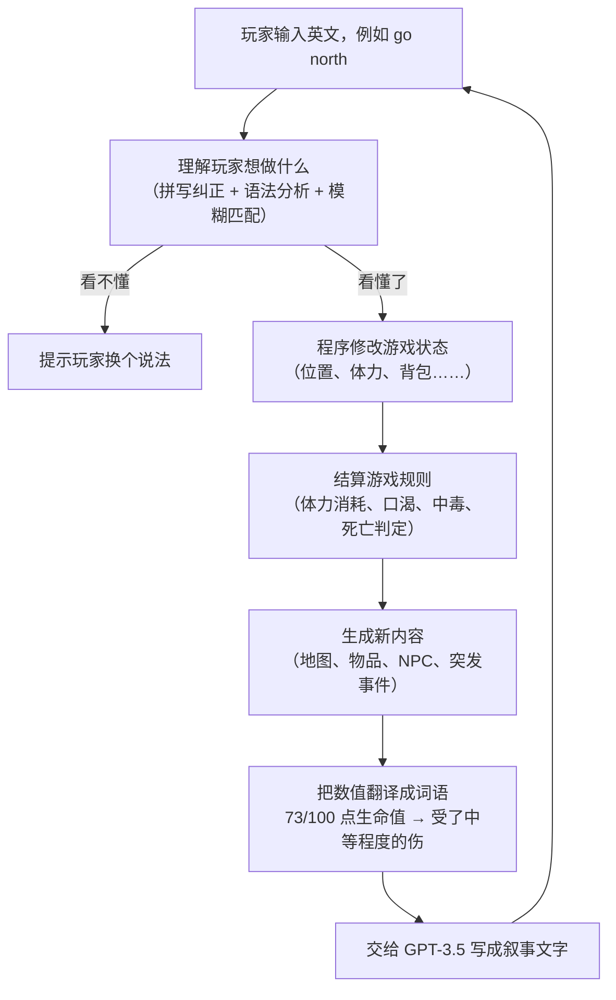

# 基于 GPT 的互动小说游戏引擎

*[English](README.md)*

一个可以真正玩起来的文字冒险游戏。玩家用英文自由输入想做的事，游戏用自然语言回应。

与常见做法不同的是：这个游戏里的世界地图、物品、事件都是**程序在运行时自动生成**的，没有任何一段剧情或场景是人工提前写好的；
而负责把这些内容"讲成故事"的大模型（GPT-3.5），被严格限制成只能**描述**发生了什么，不能**决定**发生什么。

## 项目速览

| | |
|---|---|
| **项目性质** | 本科毕业设计，曼彻斯特大学 人工智能理学学士 |
| **时间** | 2023 年 9 月 – 2024 年 4 月 |
| **我的角色** | 独立完成整体架构与引擎主体（自然语言输入解析模块由另一位同学负责，见文末贡献者） |
| **代码规模** | 引擎核心约 3,800 行 Python，测试约 870 行，全仓库约 6,650 行 |
| **技术栈** | Python、OpenAI GPT-3.5 API、模型微调、元胞自动机、spaCy 自然语言处理、NumPy、OpenCV |
| **成果** | 可运行的完整游戏 + 一套可复用的游戏引擎 |

---

## 效果演示

游戏内部只有一份**结构化的数据**，记录玩家此刻在哪、周围有什么：

```
当前位置：海滩
前方：河流    后方：陆地    右侧：海滩    左侧：陆地
地形特征：[岩石]
物品：[棕榈叶]
食物：[生鱼]
移动难度：正常
```

引擎把这份数据交给 GPT-3.5，得到玩家在屏幕上真正看到的文字：

> You find yourself standing on a tranquil beach, with the gentle sound of waves lapping against the shore.
> The scenery is serene and picturesque, offering a sense of calm amidst the surrounding elements.
>
> Ahead of you, a river flows peacefully, adding a touch of movement to the otherwise tranquil scene.
> Behind you, the beach extends into the distance, inviting exploration.
>
> To your right, the beach continues, while to your left, the land stretches out, contrasting the soft sands
> with rugged terrain.
>
> Scattered across the landscape, you notice a few large rocks, adding a natural element to the scene.
> Nearby, a palm leaf lies on the ground, a testament to the tropical climate of the area.
>
> Additionally, you spot a raw fish, a potential source of sustenance, nestled among the rocks.
>
> This idyllic setting offers a peaceful respite amidst the challenges of survival.

*（以上完整摘自项目运行日志 `modules/log.txt`，是引擎实时生成的真实输出，不是人工撰写的样例。
文中每一处景物，都能对应回上面那份数据里的一个字段。）*

**地图同样是自动生成的。** 左图是程序最初产生的随机噪点，右图是同一份数据经过算法演化后的结果 —— 陆地聚合成了成片的岛屿，
海岸线自动生长出沙滩，其上分布着森林、草原、山地与城镇：

<p align="center">
  
  
</p>

---

## 这个项目要解决的问题

做「AI 文字冒险游戏」最直接的思路，是把整个游戏交给大模型：让它描述世界、决定发生什么、并记住后果。

**但这样做会失败**，而且失败方式很典型：模型会忘记你已经喝掉了那瓶水，会让两回合前被你杀死的敌人复活，
会凭空造出一扇本不存在的门。原因不难理解 —— 世界的状态只存在于聊天记录里，一旦聊天记录太长、超出模型能记住的范围，
这些事实就不再为真。这类现象在业内被称为**幻觉**。

这个"全交给模型"的版本我也做了，就放在仓库的 `testGame/testSampleNoEngine/` 目录里，作为对照。

## 我的解法：让大模型只当"叙述者"

这个引擎把上面的关系反了过来：

- **一套常规的程序**（不含任何 AI）独占世界的全部事实 —— 玩家有多少体力、背包里有几块面包、这片森林里有没有狼，
  全部由程序精确记录和计算，跟大模型无关。
- **大模型只负责一件事**：把这些事实写成好看的文字。

用一句话概括：**模型永远不决定"什么是真的"，它只决定"真的东西该怎么读起来"。**

这样一来，模型就算写得再天花乱坠，也改不了游戏里的任何一个事实 —— 幻觉被架构本身挡在了游戏逻辑之外。
下面所有设计，都是这一个决定的推论。

### 一个回合的完整流程



---

## 三个关键设计

### 一、让模型做选择题，而不是问答题

事件结算（比如"被蛇咬了之后会怎样"）是最容易出问题的环节 —— 如果让模型自由发挥，它可能凭空给玩家加一个游戏里根本不存在的效果。

这里的做法是：引擎先把**这次事件允许出现的所有后果列成一张清单**交给模型，模型只能**从清单里挑编号**：

```
引擎给出的清单：
  可能的奖励：① 提升生命上限  ② 提升体力上限  ③ 获得一份毒液
  可能的惩罚：① 扣生命值      ② 扣体力值      ③ 进入中毒状态

模型的回答：惩罚选 ③，并附上一段描述：
  "你试图把毒液吸出来，却徒劳无功。恶心与虚弱攫住了你，接下来的路更难走了。"
```

模型对"故事怎么转折"有真实的发挥空间，但**没有能力造出设计者没定义过的效果** —— 因为它能选的每一项，
最终都对应到程序里一段写好的逻辑。

### 二、不让模型看见任何数字

在把信息交给模型之前，引擎会先把所有数值换成人话：

| 程序内部的真实状态 | 实际告诉模型的内容 |
|---|---|
| 生命值 73 / 100 | 受了中等程度的伤 |
| 体力 22 / 100 | 精疲力尽 |
| 食物新鲜度 -5 | 已经变质了 |
| 移动难度系数 4 | 极其难以通行 |
| 与 NPC 好感度 -14 | 充满敌意 |

这一步消灭了一整类问题：模型不可能在它从未收到的数字上算错，也不可能把 `HP: 73/100` 这种游戏数据泄漏进本该是小说的文字里。
额外的好处是，后续调整游戏数值平衡时，这套提示词完全不用改。

### 三、地图随机生成，但走回头路时不会变样

游戏世界是无限大的，走到边界就现场生成下一块区域。这样做最容易出的问题是：玩家原路返回时，看到的是一片**完全不同**的土地。

解决办法是给每一块区域记住一个"随机数种子"。重新走回去时，用同一个种子重新算一遍，就能得到**一模一样**的地图 ——
既不用把整张地图存下来，世界又是稳定可信的。

地形本身用**元胞自动机**生成（就是上面演示图里从噪点变成岛屿的那个算法）。十种地形按固定顺序逐层叠加，
每层都有自己的生长规则和限制条件，于是沙滩只长在海岸线上、雪原只出现在山地之上、城镇只落在适合居住的地面 ——
不需要任何人工摆放，地貌就是合理的。

---

## 游戏包含哪些内容

- **生存系统** —— 生命值、体力、口渴度、负重上限，以及口渴、中毒、恢复等状态效果
- **十种地形** —— 海洋、陆地、河流、森林、海滩、沙漠、山地、高原雪原、城镇、草原，各有不同的移动消耗和产出
- **物品自动分布** —— 每件物品都带有各地形下的出现概率，所以芦荟长在沙漠、鱼出现在河里，无需逐个地点手工编排
- **十种玩家动作** —— 移动、休息、拾取、装备、卸下、查看、进食、装水、交谈、攻击
- **突发事件** —— 生存危机（体力/生命过低、误食变质食物）与自然灾害（沙尘暴），各有触发条件和奖惩
- **NPC** —— 狼会攻击玩家，受伤后逃跑概率上升；NPC 对玩家有好感度
- **自由文本输入** —— 不需要背固定指令格式，玩家直接用英文表达，引擎负责理解

---

## 微调实验与结论

为了让模型叙事**保持前后一致**（比如一块变质的面包在后文里不能突然变新鲜），我尝试了两条路线：

1. **优化提示词** —— 每次只把与当前场景相关的信息交给模型，并先做上面第二点的"数值转人话"处理。这是最终采用的方案。
2. **模型微调** —— 人工编写"游戏状态 → 理想叙事"的样本，用 OpenAI 的微调接口训练一个专用模型。

**结论是两条路都没能彻底解决问题**，而这个负面结果本身是项目最有价值的产出：

优化提示词能稳定地修好**格式**和**语气**，但修不好**推理** —— 当保持一致需要模型跨好几项状态推演一条因果链时，
GPT-3.5 依然会出错。微调显著改变了文风，对一致性几乎没有帮助；但训练样本总共只有 25 条，
诚实的结论是**语料量远不足以判断是方法不行还是数据不够**。

真正撞上的天花板，是当时基座模型的推理能力，而不是提示词写得不好。

这也正是前面那套架构的意义所在：**既然模型必然会不一致，工程上的答案就是压缩它能够不一致的那个面** ——
把事实收归程序管理，模型再怎么出错，也错不到游戏逻辑上去。

---

<br>

> 以下内容面向开发者。非技术读者读到这里即可。

---

## 运行方式

需要 **Python 3.9+**（开发环境为 3.11）与一个 OpenAI API key。

```bash
git clone https://github.com/keepOrCounter/Third_year_project_IFadGame.git
cd Third_year_project_IFadGame

python -m venv .venv && source .venv/bin/activate   # Windows: .venv\Scripts\activate
pip install -r requirements.txt
python -m spacy download en_core_web_sm             # 指令解析器需要

cd modules        # 模块之间是扁平导入，必须在该目录下运行
python main.py
```

启动后会在命令行询问 API key，随后即可游玩：

```
To start the game, please provide an openai key>>>
What would you do?>>> go north
What would you do?>>> take berries
What would you do?>>> eat berries
```

输入 `__exit` 退出。所有提示词与模型返回都会追加写入 `modules/log.txt`。

> **首次运行前请先改模型。** `interactionSys.Gpt3` 里写死了一个微调模型，它仅对训练它的账号可见，
> 用其他 key 会得到 404。请把 `self.model` 改成 `"gpt-3.5-turbo"` 或其他可用模型。详见[已知限制](#已知限制)。

### 微调数据管线

```bash
cd data
python transfer.py    # backup.json  →  output.jsonl（转成 OpenAI 微调所需格式）
python check.py       # 格式校验 + token 成本估算，参照 OpenAI cookbook
```

### 测试

```bash
cd modules && python -m unittest testMain -v
```

覆盖移动与消耗、背包增删、进食、拾取、装备、战斗以及内容生成器。**目前 7 个用例中只有 1 个能通过** ——
原因见[已知限制](#已知限制)。

## 项目结构

| 路径 | 内容 |
|---|---|
| `modules/main.py` | 回合主循环、生存规则、计分、程序入口 |
| `modules/status_record.py` | 纯状态模型 —— 物品、NPC、地点、玩家、世界。不含游戏逻辑与 GPT |
| `modules/Pre_definedContent.py` | 指令实现、地图生成规则、状态效果引擎，以及全部内容定义 |
| `modules/PCGsys.py` | 地图 / 物品 / NPC / 事件生成器与逐回合调度 |
| `modules/interactionSys.py` | GPT 客户端、提示词构造与叙事生成；自然语言输入解析 |
| `modules/testMain.py` | 规则与指令层的测试套件 |
| `data/` | 微调数据管线：`backup.json` → `transfer.py` → `output.jsonl` → `check.py` |
| `test/` | NLP 解析与 NPC 相关的独立验证脚本 |
| `testGame/testSampleNoEngine/` | 无引擎的对照原型，以及柏林噪声地图实验 |
| `docs/ARCHITECTURE.md` | 逐模块的设计说明与扩展指南 |

## 已知限制

这是 2024 年 4 月提交时的代码，此后未做现代化改造。下面列出的是「问题 + 我会怎么修」——
放在 README 而不是私人 TODO 里，是因为 clone 这个仓库的人有权先知道自己拿到的是什么。

### GPT 集成锁死在一套已经不存在的配置上

三个独立的问题，都在 `interactionSys.Gpt3` 里：

1. `self.model` 是一个微调 checkpoint（`ft:gpt-3.5-turbo-0125:3rdprojectgroup:…`），仅对训练它的账号可见 ——
   其他任何 key 都会拿到 404。
2. 调用方式是 `openai.ChatCompletion.create`，该接口在 `openai>=1.0` 中已被移除，因此 requirements 锁了
   `openai<1.0`。
3. `gpt-3.5-turbo` 本身是正在退场的一代模型。

**修法**是干脆不再写死模型：让 `Gpt3` 从环境变量读取 `api_key`、`model` 与 `base_url`，并把 `inquiry`
迁移到 1.x 客户端。`base_url` 可配置之后，叙事器可以是任何 OpenAI 兼容端点，包括经由 Ollama 或 vLLM
的本地模型。

值得一提的是这个改动**不会碰到**什么：`status_record.py`、`Pre_definedContent.py`、`main.py` ——
状态模型、内容定义、指令层与回合主循环 —— 逐字节不变。整个大模型集成可以被替换掉而模拟系统毫无察觉，
而这正是当初做这套架构所要换取的性质。

### 返回值解析不够健壮

叙事层对模型的信任超出了应有的程度：

| 位置 | 问题 |
|---|---|
| `interactionSys.py:260, 303, 338, 390` | 裸 `except:` 吞掉一切（含 `KeyboardInterrupt`），并掩盖真实原因 |
| `interactionSys.py:266, 308, 316, 345, 414` | 三次重试全失败后，`gpt_response` / `result` 从未被绑定 → `NameError` |
| `interactionSys.py:258, 388` | `parsed_output[keyList[1]]` 按**键的顺序**取描述；模型换个键序就会取到错误字段 |
| `interactionSys.py:252-254` | 换行 round-trip hack，只是为了让 `ast.literal_eval` 能接受返回值 |
| 多处 | `ast.literal_eval` 与 `json.loads` 在不同调用点混用；前者无法接受 JSON 的 `true`/`false`/`null` |
| `PCGsys.py:550, 560` | 模型返回的奖惩索引未做校验 —— 越界抛 `IndexError`，非数字抛 `ValueError`，`eventCommandMap` 查找也没有 `KeyError` 保护 |

**修法**：启用 JSON mode / structured outputs，让大部分解析失败从源头消失；对返回值做 schema 校验，
并把索引裁剪到引擎给出的菜单范围内；重试耗尽时退回引擎自己生成的模板描述，而不是直接失败。
最后一条其实是本项目自身前提的直接推论 —— 叙事是装饰性的，事实存放在模拟系统里，所以叙事器挂掉
应当降级文本质量，而不是让游戏停下来。目前它会让游戏停下来。

### 测试套件已经漂移

`modules/testMain.py` 是按项目中期的指令层 API 写的，7 个用例中今天只有 1 个能通过。原因都是机械性的，
而非深层设计问题：动作注册表的键现在是 `"Go"` 而非 `"Move"`；`pickUp` / `equip` 现在会写
`action.nameForDescription`，因此要求传入真实的 `Actions` 对象，而测试传的是 `None`；`npcGenerator`
新增了 `worldStatus` 参数；`test_attack` 则阻塞在下面提到的交互式消歧提问上。

### 其余较小的问题

- **消歧依赖 `input()` 阻塞。** 当周围有多个可匹配物品时，`consume` 与 `pickUp` 会在指令层内部通过标准输入
  发问，这让游戏逻辑与终端耦合，也正是上述那些分支难以测试的原因。
- **没有存档 / 读档。** 世界可以由种子复现，但玩家与背包状态没有持久化。
- **地图可视化需要桌面环境。** `MapGenerator.visualized` 使用 `cv2.imshow`；无头机器上请改用 `cv2.imwrite`
  （本页顶部的两张图正是这样生成的）。

## 贡献者

- **[@keepOrCounter](https://github.com/keepOrCounter)** —— 引擎架构；状态模型、规则系统、指令层、
  程序化内容生成、事件系统、GPT 集成与提示词设计、微调数据管线、测试套件。
- **[@WaiHL](https://github.com/WaiHL)** —— `interactionSys.py` 中的自然语言输入解析模块
  （拼写纠正与 spaCy 语法分类器），以及 `test/` 中的相关验证脚本。

## 许可

尚未选择开源许可证 —— 默认保留所有权利。若希望这份代码可被复用，请添加 `LICENSE` 文件
（个人作品集项目通常选 MIT）；添加前请先确认所在院校关于毕业设计知识产权的规定。
