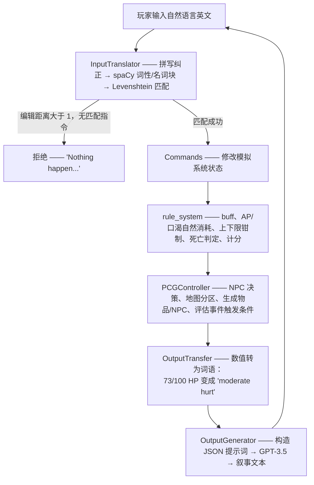

# IFadGame — 基于 GPT 叙事的互动小说游戏引擎

*[English](README.md)*

一个可玩的文字冒险游戏引擎：**世界、物品、地形与事件均在运行时生成**，而非人工预先编写；同时在架构上把
GPT-3.5 严格限制为**叙事者**，不让它驱动游戏本身。

> 本科毕业设计，曼彻斯特大学人工智能理学学士（2023 年 9 月 – 2024 年 4 月）。

<p align="center">
  
  
</p>
<p align="center">
  <em>左：地图生成器起步时的随机噪声。右：同一种子经过 5 代元胞自动机演化并叠加地形之后 —— 陆块由海滩环绕，
  其上分布森林、草原、山地与城镇。两张图均由本仓库中的引擎生成。</em>
</p>

---

## 这个项目想解决的问题

做「AI 文字冒险」最直接的思路，是把整个游戏交给大模型：由它描述世界、决定发生什么、并记住后果。这个原型也在本仓库里
（`testGame/testSampleNoEngine/`），它的失败方式完全可以预料：模型会忘记你已经喝掉了那瓶水，会让两回合前被你杀死的
敌人复活，会凭空造出一扇本不存在的门。世界状态只存在于对话历史中，一旦滑出上下文窗口，它就不再为真。

**本引擎把这个关系反了过来。** 由一套常规的模拟系统 —— 面向对象的状态管理、规则系统、程序化内容生成 —— 独占世界的
全部事实；GPT-3.5 只被调用来把这些状态转写成自然语言。模型永远不决定「什么是真的」，它只决定「真的东西该怎么读起来」。

下面所有设计，都是这一个决定的推论。

---

## 一个回合是怎么走完的



主循环本身在 [`modules/main.py`](modules/main.py)，刻意写得很薄 —— 上面每一步都是对某个模块的调用，
可以单独替换或单独测试。

---

## 三处值得读源码的设计

### 1. GPT 决定事件走向，但只能从引擎写好的菜单里选

让大模型决定事件结果，正是幻觉最容易钻进来的地方。这里的做法是：把事件、玩家动作，以及引擎给出的两个列表
`possible_reward` 与 `possible_penalty` 一起交给模型，并要求它**只能回答这两个列表的下标**：

```jsonc
// 引擎发出的内容
{
  "event_name": "Venomous Encounter",
  "player action": "suck the attacked part",
  "possible reward":  ["increase maximum hp", "increase maximum action point", "obtain a poison"],
  "possible penalty": ["decrease hp", "decrease action point", "add poisoning status"]
}

// 模型被允许给出的回答
{ "successful": false, "fail": false, "reward": [], "penalty": [2],
  "development description": "You decide to suck the wound, hoping to extract the poison…" }
```

这些下标随后经由 `eventCommandMap` → `commandTranslate` 落到对 `Player_status` 的真实修改上。模型对
「故事怎么转折」拥有真实的叙事权，却完全没有能力造出设计者没有定义过的效果。参见
[`PCGsys.eventGenerator.event_handler`](modules/PCGsys.py) 与 `DefininedSys.get_eventCommandMap`。

### 2. 任何数值都不会进入提示词

`OutputTransfer.outputWordMap`（[`modules/Pre_definedContent.py`](modules/Pre_definedContent.py)）是一张声明式
的映射表，在构造提示词**之前**，就把引擎里的每一个量转成叙事者真正会用的词汇：

| 引擎状态 | 告诉 GPT 的内容 |
|---|---|
| `hp = 73 / 100` | `"moderate hurt"` |
| `action_point = 22 / 100` | `"exhausted"` |
| `freshness = -5` | `"stale"` |
| `move_dLevel = 4` | `"extremely hard to travel through"` |
| `relationship = -14` | `"hostile"` |

这从源头上消灭了一整类失败：模型不可能在它从未收到的数字上算错，也不可能把 `HP: 73/100` 泄漏进本该是散文的文本里。
额外的好处是，设计者调整数值平衡时，同一套提示词模板依然有效。

### 3. 随机，但不健忘的程序化生成

地形由二维元胞自动机（`cellpylib`）生成，而非柏林噪声 —— 两者的对比实验保留在 `testGame/testSampleNoEngine/`。
十种地形按固定顺序逐层叠加，每层有自己的 CA 规则和 `allowedAppearUpon` 约束，于是海滩只长在海岸线上、
雪原只出现在山地之上、城镇只落在可居住的地面。

世界是无界的：它被切分成区块，玩家跨越边界时才生成下一块。按需生成的麻烦在于，朴素实现会让你每次走回头路时
看到一个**不一样**的世界。`MapGenerator.map_Seed()` 为每个区块坐标分配并缓存一个种子，因此重访区块会被逐位
一致地重新生成，而无需把地图存下来。

---

## 引擎包含什么

- **生存模拟** —— 生命值、行动点、口渴度、负重，以及一套 buff 系统（`thirsty`、`poisoning`、`recovery`），
  其触发与结束条件均以 lambda 表达。
- **十种地形** —— 海洋、陆地、河流、森林、海滩、沙漠、山地、高原雪原、城镇、草原；各自拥有移动代价与
  独立的物品/NPC 生成表。
- **按权重生成内容** —— 每件物品带有各地形下的出现概率（0–20，≥20 表示必定出现），因此芦荟出现在沙漠、
  鱼出现在河流，无需为每个地点手工编写内容。
- **十个玩家动作** —— `Go`、`Rest`、`Take`、`Equip`、`Unequip`、`Check`、`Eat`、`Fill`、`Talk`、`Attack`，
  均以数据（`Actions`）定义，而非解析器里的分支。
- **事件系统** —— 生存危机（低行动点/生命值/口渴、误食不可食用物）与灾害（沙尘暴，按地形加权），
  各自带有触发条件、时限与奖惩菜单。
- **NPC** —— 狼具有生命值、攻击力、随受伤上升的逃跑概率，以及对玩家的关系度。
- **自由文本输入** —— 没有 `动词 名词` 式语法；玩家直接输入英文，由「拼写纠正 → spaCy → Levenshtein」
  管线映射到指令词表。

## 仓库结构

| 路径 | 内容 |
|---|---|
| `modules/main.py` | 回合主循环、生存规则、计分、程序入口 |
| `modules/status_record.py` | 纯状态模型 —— 物品、NPC、地点、玩家、世界。不含游戏逻辑与 GPT |
| `modules/Pre_definedContent.py` | 指令实现、CA 地图规则、buff 引擎，以及内容注册表（`DefininedSys`） |
| `modules/PCGsys.py` | 地图 / 物品 / NPC / 事件生成器与逐回合的 `PCGController` |
| `modules/interactionSys.py` | GPT 客户端、提示词构造与叙事生成；自然语言输入解析 |
| `modules/testMain.py` | 规则与指令层的 `unittest` 测试套件 |
| `data/` | 微调数据管线：`backup.json` → `transfer.py` → `output.jsonl` → `check.py` |
| `test/` | NLP 解析与 NPC 相关的独立验证脚本 |
| `testGame/testSampleNoEngine/` | 无引擎的对照原型，以及柏林噪声地图实验 |
| `docs/ARCHITECTURE.md` | 逐模块的设计说明与扩展指南 |

---

## 运行方式

需要 **Python 3.9+**（开发环境为 3.11）与一个 OpenAI API key。

```bash
git clone https://github.com/keepOrCounter/Third_year_project_IFadGame.git
cd Third_year_project_IFadGame

python -m venv .venv && source .venv/bin/activate   # Windows: .venv\Scripts\activate
pip install -r requirements.txt
python -m spacy download en_core_web_sm             # 指令解析器需要

cd modules        # 模块之间是扁平导入，必须在该目录下运行
python main.py
```

游戏启动时会在标准输入询问 API key，随后在终端中进行：

```
To start the game, please provide an openai key>>>
What would you do?>>> go north
What would you do?>>> take berries
What would you do?>>> eat berries
```

输入 `__exit` 退出。所有提示词与返回结果都会追加写入 `modules/log.txt`，便于复盘。

> **首次运行前请先改模型。** `interactionSys.Gpt3.__init__` 中写死了一个微调模型
> （`ft:gpt-3.5-turbo-0125:3rdprojectgroup:…`），它仅对训练它的账号可见，用其他 key 会得到 404。
> 请把 `self.model` 改成 `"gpt-3.5-turbo"`，或任何你想用来叙事的模型。详见[已知限制](#已知限制)。

### 测试

```bash
cd modules && python -m unittest testMain -v
```

覆盖移动与 AP/口渴消耗、背包增删、进食、拾取、装备、战斗以及内容生成器。其中一部分用例仍面向早期版本的
指令 API —— 详见[已知限制](#已知限制)。

---

## 微调实验

为了让 GPT-3.5 叙事**保持一致** —— 让一块变质的面包始终是变质的，让文本不与模拟系统自相矛盾 —— 尝试了两条路线。

**路线一：上下文感知的提示词模板。** 用结构化 JSON 提示词，只携带与当前描述目标相关的状态，并先经过上文所述的
「数值 → 语言」抽象。这是最终交付的方案。

**路线二：有监督微调。** 人工编写少量「游戏状态 → 理想叙事」样本对，转换为 OpenAI chat JSONL 格式，
并做格式与 token 成本校验：

```bash
cd data
python transfer.py    # backup.json  →  output.jsonl（system/user/assistant 三元组）
python check.py       # 格式校验 + tiktoken 成本估算，参照 OpenAI cookbook
```

**实际结果。** 两条路线都没能补上差距。提示词工程能稳定地修好**格式**与**语气**，却修不好**推理**：当一致性
要求叙事者跨多个状态字段推演一条蕴含链时，GPT-3.5 依然会崩。微调显著改变了文风，对一致性却几乎没有帮助 ——
而训练样本总共只有 25 条，诚实的结论是语料量远不足以把这个结果归因于方法本身，而非归因于数据。
真正撞上的天花板，是基座模型的推理能力，而不是提示词格式。

这个负面结果是本项目最有价值的产出，也正是上述架构的意义所在：既然模型**必然**会不一致，
工程上的答案就是压缩它能够不一致的那个面。

---

## 已知限制

这是 2024 年 4 月提交时的代码，此后未做现代化改造。下面列出的是「问题 + 我会怎么修」—— 放在 README 而不是
私人 TODO 里，是因为 clone 这个仓库的人有权先知道自己拿到的是什么。

### GPT 集成锁死在一套已经不存在的配置上

三个独立的问题，都在 `interactionSys.Gpt3` 里：

1. `self.model` 是一个微调 checkpoint（`ft:gpt-3.5-turbo-0125:3rdprojectgroup:…`），仅对训练它的账号可见 ——
   其他任何 key 都会拿到 404。
2. 调用方式是 `openai.ChatCompletion.create`，该接口在 `openai>=1.0` 中已被移除，因此 requirements 锁了
   `openai<1.0`。
3. `gpt-3.5-turbo` 本身是正在退场的一代模型。

**修法**是干脆不再写死模型：让 `Gpt3` 从环境变量读取 `api_key`、`model` 与 `base_url`，并把 `inquiry`
迁移到 1.x 客户端。`base_url` 可配置之后，叙事器可以是任何 OpenAI 兼容端点，包括经由 Ollama 或 vLLM
的本地模型。

值得一提的是这个改动**不会碰到**什么：`status_record.py`、`Pre_definedContent.py`、`main.py` ——
状态模型、内容注册表、指令层与回合主循环 —— 逐字节不变。整个大模型集成可以被替换掉而模拟系统毫无察觉，
而这正是当初做这套架构所要换取的性质。

### 返回值解析不够健壮

叙事层对模型的信任超出了应有的程度：

| 位置 | 问题 |
|---|---|
| `interactionSys.py:260, 303, 338, 390` | 裸 `except:` 吞掉一切（含 `KeyboardInterrupt`），并掩盖真实原因 |
| `interactionSys.py:266, 308, 316, 345, 414` | 三次重试全失败后，`gpt_response` / `result` 从未被绑定 → `NameError` |
| `interactionSys.py:258, 388` | `parsed_output[keyList[1]]` 按**键的顺序**取描述；模型换个键序就会取到错误字段 |
| `interactionSys.py:252-254` | 换行 round-trip hack，只是为了让 `ast.literal_eval` 能接受返回值 |
| 多处 | `ast.literal_eval` 与 `json.loads` 在不同调用点混用；前者无法接受 JSON 的 `true`/`false`/`null` |
| `PCGsys.py:550, 560` | 模型返回的奖惩索引未做校验 —— 越界抛 `IndexError`，非数字抛 `ValueError`，`eventCommandMap` 查找也没有 `KeyError` 保护 |

**修法**：启用 JSON mode / structured outputs，让大部分解析失败从源头消失；对返回值做 schema 校验，
并把索引裁剪到引擎给出的菜单范围内；重试耗尽时退回引擎自己生成的模板描述，而不是直接失败。
最后一条其实是本项目自身前提的直接推论 —— 叙事是装饰性的，事实存放在模拟系统里，所以叙事器挂掉
应当降级文本质量，而不是让游戏停下来。目前它会让游戏停下来。

### 测试套件已经漂移

`modules/testMain.py` 是按项目中期的指令层 API 写的，7 个用例中今天只有 1 个能通过。原因都是机械性的，
而非深层设计问题：动作注册表的键现在是 `"Go"` 而非 `"Move"`；`pickUp` / `equip` 现在会写
`action.nameForDescription`，因此要求传入真实的 `Actions` 对象，而测试传的是 `None`；`npcGenerator`
新增了 `worldStatus` 参数；`test_attack` 则阻塞在下面提到的交互式消歧提问上。

### 其余较小的问题

- **消歧依赖 `input()` 阻塞。** 当周围有多个可匹配物品时，`consume` 与 `pickUp` 会在指令层内部通过标准输入
  发问，这让游戏逻辑与终端耦合，也正是上述那些分支难以测试的原因。
- **没有存档 / 读档。** 世界可以由种子复现，但玩家与背包状态没有持久化。
- **地图可视化需要桌面环境。** `MapGenerator.visualized` 使用 `cv2.imshow`；无头机器上请改用 `cv2.imwrite`
  （本页顶部的两张图正是这样生成的）。

## 贡献者

- **[@keepOrCounter](https://github.com/keepOrCounter)** —— 引擎架构；状态模型、规则系统、指令层、
  程序化内容生成、事件系统、GPT 集成与提示词设计、微调数据管线、测试套件。
- **[@WaiHL](https://github.com/WaiHL)** —— `interactionSys.py` 中的自然语言输入解析模块
  （拼写纠正与 spaCy 语法分类器），以及 `test/` 中的相关验证脚本。

## 许可

尚未选择开源许可证 —— 默认保留所有权利。若希望这份代码可被复用，请添加 `LICENSE` 文件
（个人作品集项目通常选 MIT）；添加前请先确认所在院校关于毕业设计知识产权的规定。
